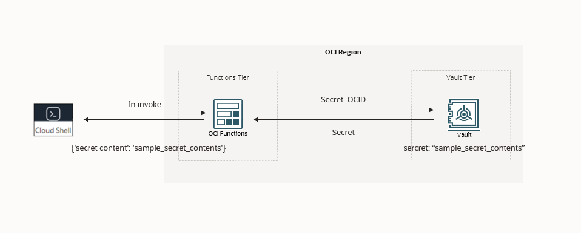
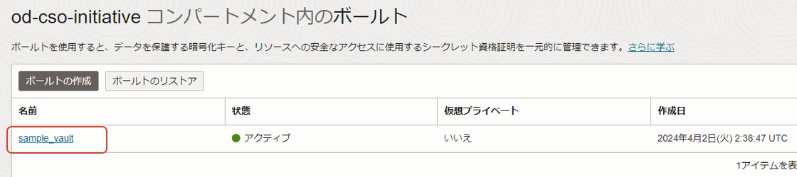

# OCI Vault Hands-on

* [前提条件](#前提条件)
* [ハンズオン全体像](#ハンズオン全体像)
* [事前準備](#事前準備)
* [OCI Vaultのハンズオン](#oci-vaultのハンズオン)
    * [OCI Vaultの作成](#oci-vaultの作成)
        * [Master Encryption Keysの作成](#master-encryption-keysの作成)
        * [Secretの作成](#secretの作成)
    * [OCI Functionsの作成](#oci-functionsの作成)
        * [アプリケーションの作成](#アプリケーションの作成)
        * [コンテキストの更新](#コンテキストの更新)
        * [Function コードの説明](#function-コードの説明)
        * [Functionのデプロイ](#function-のデプロイ)
        * [Functionを用いてSecretを取得](#function-を用いてsecretを取得)


## 前提条件
* Compute, OCI Functions を実行するために必要なポリシーや仮想ネットワーク(VCN)が作成済みであること
* Cloud Shell が使用可能な環境であること
    * 未実施の場合は、[Oracle Cloud Infrastructure ドキュメント - クラウド・シェル](#https://docs.oracle.com/ja-jp/iaas/Content/API/Concepts/cloudshellintro.htm)を参考に、必要なポリシー等を設定してください
    * Cloud Shell/OCI Functions の CPU アーキテクチャは、X86 で統一すること
* 各種ツール、言語、ライブラリのバージョンは、Cloud Shell に事前にインストールされているものに従います
    * OCI CLI: 3.38.0
    * Fn Project: 0.6.29
    * Python: 3.8.13
    * SDK for Python: 2.125.0

## ハンズオン全体像


## 事前準備
### ハンズオンで使うコードのクローン
ハンズオンを実施するにあたり、本リポジトリを Cloud Shell 上にクローンします。
```console
git clone https://github.com/sh-sho/function_auth.git
```
リポジトリは以下のような構成です。
```console
$ tree function_auth/
function_auth/
├── README.md
└── sample-auth-func
    ├── func.py
    ├── func.yaml
    └── requirements.txt

1 directory, 4 files
```

## OCI Vaultのハンズオン
### OCI Vaultの作成
OCI ConsoleからOCI Vaultsを作成します。ハンバーガーメニュー > アイデンティティとセキュリティ > キー管理とシークレット管理 > ボールト を選択します。


次にボールトの作成をクリックします。


ボールトの名前を入力し作成します。


### Master Encryption Keysの作成
次にKeyを作成します。
先ほど作成したボールトを選択します


マスター暗号化キーを作成します。


キーの作成をクリックし以下を参考に必要な項目を埋めてマスター暗号化キーを作成します。


### Secretの作成
次にSecretを作成します。シークレットを使うことでユーザー名やバスワードなどを、先ほど作成したマスター暗号化キーを使って暗号化して管理ができます。


シークレットの作成をクリックし必要な項目を埋めてシークレットを作成します。


作成したシークレットのOCIDを確認します。

シークレットのOCIDをコピーします。この値は後で使用します。


### OCI Functionsの作成
#### アプリケーションの作成
OCI Consoleから、OCI Functions の実行環境を作成します。ハンバーガーメニュー > 開発者サービス > ファンクション > アプリケーションをクリックします。


アプリケーションの作成をクリックします。


以下のように入力し、アプリケーションを作成します。
* 名前: sample-auth-app-<ご自身の名前等>
* VCN: 作成済みの VCN
* サブネット: 作成済み VCN に含まれるパブリック・サブネット
* シェイプ: GENERIC_X86


#### コンテキストの更新
アプリケーションの作成が完了したら、Cloud Shellを再度開いて、以下のように実行します。
```console
fn list context
```
実行結果
```console
CURRENT NAME            PROVIDER        API URL                                                 REGISTRY
        ap-tokyo-1      oracle-ip       https://functions.ap-tokyo-1.oci.oraclecloud.com        nrt.ocir.io/orasejapan/sobata
*       default         default         http://localhost:8080
```

ハンズオンで使用するリージョンを選択します。

```console
fn use context ap-tokyo-1
```
実行結果
```console
Now using context: ap-tokyo-1
```

使用するコンテキストを更新します。
```console
COMPARTMENT_ID=<使用するコンパートメントID>
fn update context oracle.compartment-id $COMPARTMENT_ID
```

実行結果
```console
Current context updated oracle.compartment-id with ocid1.compartment.oc1..aaaaaxxxx
```

ハンズオンで使用するコンテナ・レジストリ（OCIR）のベースパスをコンテキストに設定するために、テナンシーの namespace を取得します。OCI Console 右上の人型アイコンからテナンシをクリックします。


テナンシの詳細画面から、オブジェクト・ストレージ・ネームスペースをコピーします。


後述の手順のために、変数に格納しておきます。
```console
NAMESPACE="<namespace>"
```

ハンズオンで使用するコンテナ・レジストリ（OCIR）のベースパスをコンテキストに設定します。 ここでの、任意の名前はハンズオン環境内で一意となるように設定してください。

```console
fn update context registry nrt.ocir.io/${NAMESPACE}/<任意の名前>
```

実行結果例（環境によって実行結果は異なります）
```console
Current context updated registry with nrt.ocir.io/orasejapan/<namespace>
```

ここで、今までの設定事項を確認してみます。
```console
fn inspect context
```
実行結果例（環境によって実行結果は異なります）
```console
Current context: ap-tokyo-1

api-url: https://functions.ap-tokyo-1.oci.oraclecloud.com
oracle.compartment-id:  <ハンズオンで使用するコンパートメントID>
provider: oracle-ip
registry: nrt.ocir.io/<namespace>/sobata
```

### Function の実行
#### Function コードの説明
以下のようなFunction コードを実行します。
```python
import io
import oci
import base64
import json
import logging
import os

from fdk import response

# 1 
rp = os.getenv("OCI_RESOURCE_PRINCIPAL_VERSION", "")
if rp == "2.2":
    signer = oci.auth.signers.get_resource_principals_signer()
else:
    signer = oci.auth.signers.InstancePrincipalsSecurityTokenSigner()

client = oci.secrets.SecretsClient({}, signer=signer)

# 2
def get_text_secret(secret_ocid):
    get_secret = client.get_secret_bundle(secret_ocid).data.secret_bundle_content.content.encode('utf-8')
    decrypt_secret = base64.b64decode(get_secret).decode("utf-8")
    logging.getLogger().info(get_secret)
    return {"secret content": decrypt_secret}

def handler(ctx, data: io.BytesIO = None):
    logging.getLogger().info("function start")

    secret_ocid = secret_type = ""
    try:
        cfg = dict(ctx.Config()) # ... 3
        secret_ocid = cfg["secret_ocid"]
        logging.getLogger().info("Secret ocid = " + secret_ocid)
        secret_type = cfg["secret_type"]
        logging.getLogger().info("Secret type = " + secret_type)
    except Exception as e:
        print('ERROR: Missing configuration keys, secret ocid and secret_type', e, flush=True)
        raise

    secret_text = get_text_secret(secret_ocid) # ... 4
    logging.getLogger().debug("secret detail")
    logging.getLogger().debug(secret_text)

    logging.getLogger().debug("Inside Python Hello World function")
    return response.Response(
        ctx, response_data=secret_text,
        headers={"Content-Type": "application/json"}
    )

```

コードを説明します。

1. OCI Functionsにの認証・認可の処理です。OCI FunctionsからほかのOCIリソース (OCI Vault) のAPIを実行するための処理です。
2. OCI VaultのSecretを取得する関数です。SecretのOCIDをもとに、Secretを取得しています。SecretはBase64エンコードされているため、デコードしています。
3. FunctionsのConfigurationから`secret_ocid`と`secret_type`をkeyに持つ値を取得しています。
4. `secret_ocid`を`get_text_secret`関数に渡し、Secretを取得します。

#### OCIR にログインするための資格情報を取得する
OCIR にログインするための資格情報を取得します。OCI Console 右上の人型アイコンをクリックし、自身のユーザー名（メールアドレス）が表示されている項目をクリックします。


ユーザーの詳細画面に表示されているユーザー名 (以下、図中では `oracleidentitycloudservice/sho.obata@oracle.com`) を以下のように変数に設定します。


```console
DOCKER_USERNAME="${NAMESPACE}/<コピーしたユーザー名>"
```
ユーザーの詳細画面に表示されている認証トークンをクリックします。
トークンの生成をクリックします。


認証トークンを生成します。生成された認証トークンをコピーし、以下のように変数に設定します。

```console
DOCKER_PASSWORD="<コピーした認証トークン>"
```

以下のように、実行し OCIR へログインしておきます。
```
docker login -u $DOCKER_USERNAME -p $DOCKER_PASSWORD nrt.ocir.io
```

実行結果
```console
WARNING! Using --password via the CLI is insecure. Use --password-stdin.
WARNING! Your password will be stored unencrypted in /home/ubuntu/.docker/config.json.
Configure a credential helper to remove this warning. See
https://docs.docker.com/engine/reference/commandline/login/#credentials-store

Login Succeeded
```

#### Function のデプロイ
作成したアプリケーションに Function コードをデプロイします。
```console
cd function_auth/sample-auth-func
fn deploy -v --no-bump --app sample-auth-app-<ご自身の名前等>
```

実行結果
```console
1094a795a2ef: Pushed 
3a41fdf53716: Pushed 
e1f042f0f0b2: Pushed 
cffcdefe4259: Pushed 
08a2edef96b9: Pushed 
e0f4a6983934: Pushed 
8b4d3bacf0d7: Pushed 
0.0.8: digest: sha256:59c54085e161b7ba7e3db2168278a6de4ac2b5679eca819e6252ebbc46573791 size: 1782
Updating function sample-auth-func using image nrt.ocir.io/<namespace>/sobata/sample-auth-func:0.0.8...
Successfully created function: sample-auth-func with nrt.ocir.io/<namespace>/sobata/sample-auth-func:0.0.8
```
#### Function のConfigurationの設定
次にFunctionのConfigurationを設定します。作成したFunctionのApplicationの画面に行きます。
作成したファンクションをクリックします。


構成をクリックして以下の2つのキーと値のペアを設定します。


secret_ocidは[シークレットの作成](#secretの作成)でコピーしたシークレットのOCIDを記入します。

#### Function を用いてSecretを取得
作成したFunctionを実行します。
```console
$ fn invoke sample-auth-app sample-auth-func
```
実行結果例
```console
{'secret content': 'sample_secret_contents'}
```
OCI VaultのSecretから値が取得できていることを確認します。
